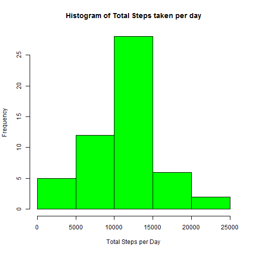
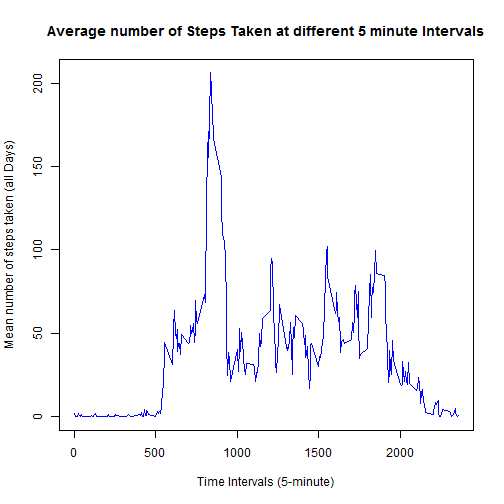
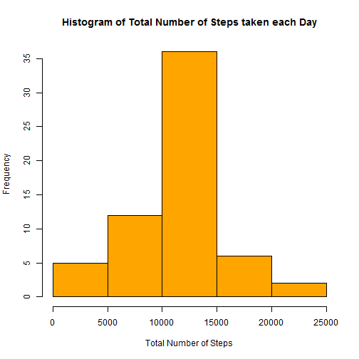

## Setting global option to read codes

```r
opts_chunk$set(echo = TRUE)
```
## Unzipping the activity.zip file from local drive

```r
unzip("./activity.zip")
```

## Loading and preprocessing the data

```r
data<-read.csv("./activity.csv",sep=",",stringsAsFactor=FALSE,na.string=NA)
data$date<-as.Date(data$date,"%Y-%m-%d")
```
## What is mean total number of steps taken per day?
- loading the library and transform data for analysis

```r
library(datasets)
totalSteps <- aggregate(steps ~ date, data = data, sum, na.rm = TRUE)
```
- Make a histogram of the total number of steps taken each day


```r
hist(totalSteps$steps, col = "green", xlab = "Total Steps per Day", ylab = "Frequency", 
    main = "Histogram of Total Steps taken per day")
```

 

- Calculate and report the mean and median total number of steps taken per day


```r
showMean <- mean(totalSteps$steps)
showMedian <- median(totalSteps$steps)
```
- The mean total number of steps taken per day is 1.0766 &times; 10<sup>4</sup> steps.
- The median total number of steps taken per day is 10765 steps.

## What is the average daily activity pattern?

- Make a time series plot (i.e. type = "l") of the 5-minute interval (x-axis) and the average number of steps taken, averaged across all days (y-axis)

```r
stepsInterval <- aggregate(steps ~ interval, data = data, mean, na.rm = TRUE)
plot(steps ~ interval, data = stepsInterval, type = "l", xlab = "Time Intervals (5-minute)", 
    ylab = "Mean number of steps taken (all Days)", main = "Average number of Steps Taken at different 5 minute Intervals", 
    col = "blue")
```

 

- Which 5-minute interval, on average across all the days in the dataset, contains the maximum number of steps?


```r
showStepInterval <- stepsInterval[which.max(stepsInterval$steps), ]$interval
```
- It is the 835 interval.

## Imputing missing values

- Calculate and report the total number of missing values in the dataset (i.e. the total number of rows with NAs)


```r
showSum <- sum(is.na(data))
```

- Total 'r showSum' rows are missing

- Devise a strategy for filling in all of the missing values in the dataset. The strategy does not need to be sophisticated. For example, you could use the mean/median for that day, or the mean for that 5-minute interval, etc.


```r
interval2steps <- function(interval) {
    stepsInterval[stepsInterval$interval == interval, ]$steps
}
```
- Create a new dataset that is equal to the original dataset but with the missing data filled in.


```r
dataFilled <- data
count = 0
for (i in 1:nrow(dataFilled)) {
    if (is.na(dataFilled[i, ]$steps)) {
        dataFilled[i, ]$steps <- interval2steps(dataFilled[i, ]$interval)
        count = count + 1
    }
}
cat("Total ", count, "NA values were filled.\n")
```

```
## Total  2304 NA values were filled.
```
- Make a histogram of the total number of steps taken each day and Calculate and report the mean and median total number of steps taken per day.


```r
totalStepsPerDays <- aggregate(steps ~ date, data = dataFilled, sum)
hist(totalStepsPerDays$steps, col = "orange", xlab = "Total Number of Steps", 
    ylab = "Frequency", main = "Histogram of Total Number of Steps taken each Day")
```

 

```r
mean(totalStepsPerDays$steps)
```

```
## [1] 10766
```

```r
median(totalStepsPerDays$steps)
```

```
## [1] 10766
```
Do these values differ from the estimates from the first part of the assignment?What is the impact of imputing missing data on the estimates of the total daily number of steps? : The **mean* value is the same as the value before imputing missing data because we put the mean value for that particular 5-min interval. The median value shows a little difference : but it depends on where the missing values are.

## Are there differences in activity patterns between weekdays and weekends?
- Create a new factor variable in the dataset with two levels - "weekday" and "weekend" indicating whether a given date is a weekday or weekend day.


```r
dataFilled$day = ifelse(as.POSIXlt(as.Date(dataFilled$date))$wday%%6 == 
    0, "weekend", "weekday")
# For Sunday and Saturday : weekend, Other days : weekday
dataFilled$day = factor(dataFilled$day, levels = c("weekday", "weekend"))
```
- Make a panel plot containing a time series plot (i.e. type = "l") of the 5-minute interval (x-axis) and the average number of steps taken, averaged across all weekday days or weekend days (y-axis). The plot should look something like the following, which was creating using simulated data:


```r
stepsInterval2 = aggregate(steps ~ interval + day, dataFilled, mean)
library(lattice)
xyplot(steps ~ interval | factor(day), data = stepsInterval2, aspect = 1/2, 
    type = "l")
```

 
